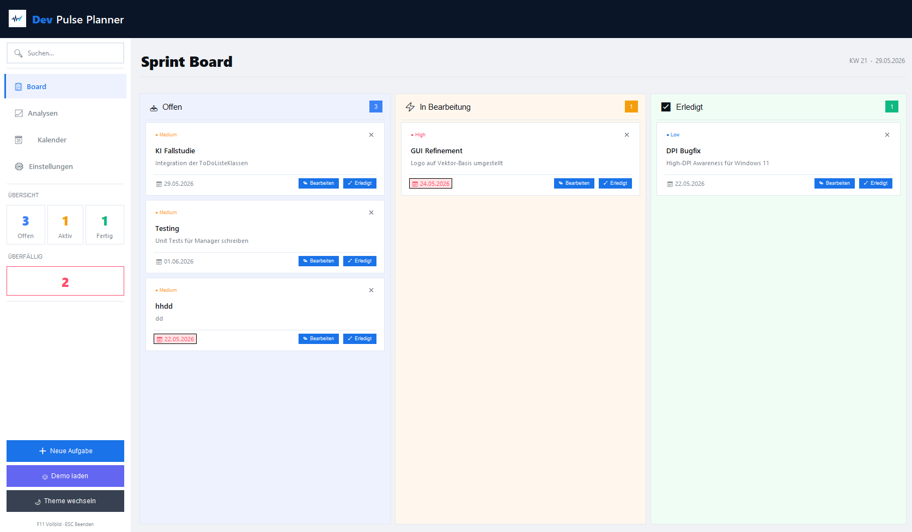
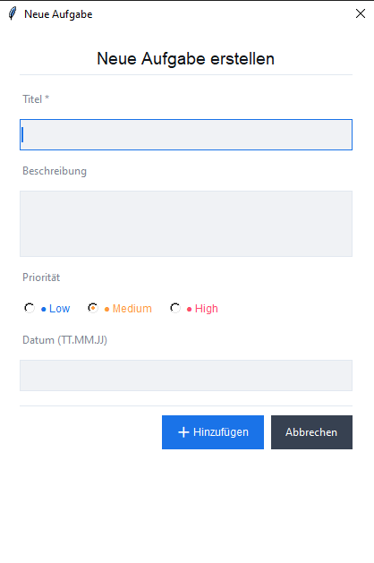

# DevPulse Planner

DevPulse Planner ist eine modulare Python-Anwendung zur Aufgabenverwaltung mit einer grafischen Benutzeroberfläche im Kanban-Stil. Aufgaben können erstellt, gesucht, priorisiert, verschoben und dauerhaft in einer lokalen JSON-Datei gespeichert werden.

Die Anwendung besteht aus einer Tkinter-GUI, einer Controller-Schicht, einer zentralen Manager-Klasse für die Geschäftslogik und einem eigenen Task-Datenmodell.

## Projektstruktur

```text
P2_KI_Fallstudie_GUI_Entwicklung/
|-- docs/
|   |-- README.md
|   `-- screenshots/
|       |-- gui-hauptansicht.png
|       `-- aufgabe-erstellen.png
|-- src/
|   |-- __init__.py
|   |-- Controller.py
|   |-- daten.json
|   |-- GUI.py
|   |-- Logo.png
|   |-- main.py
|   |-- Manager.py
|   `-- ToDoListeKlassen.py
`-- tests/
    |-- run_Test.py
    `-- test_todo.py
```

## Zentrale Dateien

- **`src/GUI.py`:** Enthält die grafische Hauptanwendung mit Sidebar, Suchfeld, Kanban-Board, Light/Dark Mode, Drag-and-Drop und Dialogen zum Erstellen von Aufgaben.
- **`src/Controller.py`:** Stellt mit dem `PlannerController` eine Schnittstelle zwischen GUI und Fachlogik bereit.
- **`src/Manager.py`:** Verwaltet Aufgaben, Statuswechsel, Löschvorgänge und die automatische Speicherung.
- **`src/ToDoListeKlassen.py`:** Definiert die Klasse `Task` inklusive Validierung, Getter/Setter und JSON-Serialisierung.
- **`src/daten.json`:** Speichert Aufgaben, gelöschte Einträge und ID-Metadaten dauerhaft.
- **`src/main.py`:** Dient als Einstiegspunkt und startet die grafische Anwendung.
- **`tests/test_todo.py`:** Enthält automatisierte Tests für Datenmodell und Manager.

## Funktionen

- Aufgaben mit Titel, Beschreibung, Priorität und optionalem Fälligkeitsdatum anlegen
- Aufgaben in den Statusspalten `offen`, `in_bearbeitung` und `erledigt` anzeigen
- Aufgaben per Button oder Drag-and-Drop zwischen Statusspalten verschieben
- Aufgaben löschen und gelöschte Einträge intern protokollieren
- Aufgaben über eine Live-Suche nach Titel und Beschreibung filtern
- Demo-Daten laden
- Anzahl offener, laufender, erledigter und überfälliger Aufgaben anzeigen
- zwischen Light Mode und Dark Mode wechseln
- Daten automatisch in `src/daten.json` speichern
- Kernfunktionen über automatisierte Tests prüfen

## GUI-Erweiterung

Die GUI wurde schrittweise aufgebaut. Zuerst entstand das Grundfenster, danach wurden Sidebar, Suchfeld, Navigationsbereich, Statistikbereich, Board-Spalten, Aufgabenkarten und Dialogfenster ergänzt. Die Oberfläche ist über den `PlannerController` mit den bestehenden Logikklassen verbunden, damit GUI und Geschäftslogik getrennt bleiben.

### Fensterstruktur und Widgets

Die Anwendung nutzt ein Hauptfenster auf Basis von `tk.Tk`. Dieses Fenster enthält links eine feste Sidebar und rechts den Hauptbereich.

### Sidebar

Die Sidebar enthält:

- das Logo aus `Logo.png`,
- ein Suchfeld mit Platzhaltertext,
- Navigations- und Aktionsbuttons,
- Statistikbereiche für Aufgabenstände,
- Buttons zum Hinzufügen von Aufgaben, Laden von Demodaten und Wechseln des Themes.

### Hauptbereich

Der Hauptbereich enthält:

- eine obere Leiste mit Ansichts- und Statusinformationen,
- ein Kanban-Board mit drei Spalten,
- dynamisch erzeugte Aufgabenkarten,
- Scrollbereiche auf Basis eines eigenen `ScrollableFrame`.

### Kanban-Board

Das Board ist in drei Spalten unterteilt:

- `offen`
- `in_bearbeitung`
- `erledigt`

Jede Spalte besitzt einen eigenen Scrollbereich. Aufgaben können über Schaltflächen oder per Drag-and-Drop verschoben werden.

### Aufgabenkarten

Die Aufgabenkarten zeigen die wichtigsten Informationen einer Aufgabe:

- Titel
- Beschreibung
- Priorität
- Fälligkeitsdatum
- Statusaktionen
- Löschfunktion

Überfällige Aufgaben werden visuell hervorgehoben. Die Priorität wird farblich dargestellt.

### Dialogfenster

Zum Erstellen neuer Aufgaben wird ein modales `Toplevel`-Fenster verwendet. Es enthält Eingabefelder für Titel, Beschreibung, Priorität und Fälligkeitsdatum.

Die GUI gibt sinnvolle Fehlermeldungen über `messagebox` aus, zum Beispiel bei:

- leerem Titel,
- ungültigem Datumsformat,
- fehlgeschlagenem Speichern oder Hinzufügen einer Aufgabe,
- fehlgeschlagenem Statuswechsel.

## Screenshots

Screenshots der fertigen Anwendung sind im Ordner `docs/screenshots` abgelegt.

### Hauptansicht der GUI



### Dialog zum Erstellen einer Aufgabe



## Bedienung der GUI

Die Anwendung ist vollständig über die grafische Oberfläche bedienbar.

- Über die Schaltfläche zum Hinzufügen wird ein Dialog für neue Aufgaben geöffnet.
- Im Dialog werden Titel, Beschreibung, Priorität und optional ein Fälligkeitsdatum eingetragen.
- Der Titel ist ein Pflichtfeld. Bleibt er leer, erscheint eine Fehlermeldung.
- Das Fälligkeitsdatum muss im Format `TT.MM.JJJJ` eingegeben werden. Bei ungültigem Format erscheint eine Fehlermeldung.
- Aufgaben erscheinen nach dem Speichern automatisch im Kanban-Board.
- Über die Statusaktionen oder per Drag-and-Drop können Aufgaben zwischen `offen`, `in_bearbeitung` und `erledigt` verschoben werden.
- Über das Suchfeld werden Aufgaben nach Titel und Beschreibung gefiltert.
- Über die Theme-Schaltfläche kann zwischen Light Mode und Dark Mode gewechselt werden.
- Über die Demo-Schaltfläche können Beispieldaten geladen werden.

## Einsatz von KI

Während der Entwicklung wurden KI-Modelle gezielt unterstützend eingesetzt, insbesondere für:

- die Strukturierung der GUI,
- die Konfiguration von Tkinter-Widgets,
- Layout-Fragen mit Frames, Grid und Pack,
- Fehlersuche bei Theme-Wechseln,
- Formulierung und Aktualisierung der Projektdokumentation.

Die fachliche Logik, Projektstruktur und finale Integration wurden anschließend im Code geprüft und angepasst.

## Installation und Start

Für das Projekt wird Python 3 benötigt. `tkinter` ist bei vielen Python-Installationen bereits enthalten. Zusätzlich werden externe Pakete für Bildverarbeitung, Tabellenanzeige und Tests verwendet.

Die Angabe `bash` über den folgenden Befehlsblöcken ist eine Markdown-Kennzeichnung für Terminalbefehle. `bash` steht für "Bourne Again Shell". In dieser README bedeutet es vor allem, dass der Block als Konsolenbefehl hervorgehoben wird. Unter Windows können die Befehle auch in PowerShell oder in der Eingabeaufforderung ausgeführt werden.

### Abhängigkeiten installieren

```bash
pip install pillow tabulate pytest
```

### Grafische Anwendung starten

```bash
python src/main.py
```

Alternativ kann die GUI direkt über `GUI.py` gestartet werden:

```bash
python src/GUI.py
```

### Tests ausführen

```bash
python tests/run_Test.py
```

## Architektur

Das Projekt folgt einer klaren Trennung von Präsentationsschicht, Steuerung, Fachlogik und Datenmodell nach dem Model-View-Controller-Prinzip.

- **Model (`ToDoListeKlassen.py`):** Definiert die Datenstruktur einzelner Aufgaben.
- **View (`GUI.py` / `main.py`):** Übernimmt Darstellung und Benutzerinteraktion.
- **Controller (`Controller.py`):** Vermittelt zwischen Oberfläche und Geschäftslogik.
- **Data Layer (`Manager.py`):** Verwaltet Aufgaben und persistente Speicherung.

## Tests

Die Tests prüfen zentrale Funktionen des Datenmodells und der Speicherlogik. Sie können über `tests/run_Test.py` ausgeführt werden.

```bash
python tests/run_Test.py
```

Damit wird überprüft, ob die Kernfunktionen unabhängig von der grafischen Oberfläche korrekt arbeiten.
